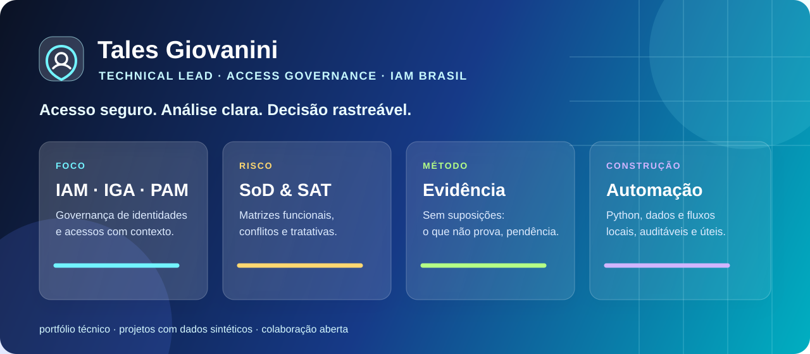

<p align="center">
  
</p>

<h1 align="center">Tales Giovanini</h1>

<p align="center">
  <strong>Eu transformo dados de acesso em decisões rastreáveis.</strong><br />
  <strong>Technical Lead · Access Governance</strong><br />
  Atualmente na <strong>IAM Brasil</strong><br />
  IAM · IGA · PAM · SoD · Governança de Acessos · Automação
</p>

<p align="center">
  <a href="https://github.com/TalesGiovanini/iam-brasil-governanca-sod-sat">Projeto SoD &amp; SAT</a>
  ·
  <a href="https://github.com/TalesGiovanini/iam-sod-sat-demo">Simulação pública</a>
</p>

---

## Meu painel de trabalho

| Foco | Como eu trabalho |
| --- | --- |
| **Governança de Identidades** | Estruturo análises de acessos com foco em rastreabilidade, menor privilégio e responsabilidade clara. |
| **SoD e riscos de acesso** | Transformo matrizes funcionais e bases heterogêneas em evidências úteis para decisão e tratativa. |
| **Automação aplicada** | Uso Python, planilhas e fluxos locais para reduzir tarefas repetitivas sem perder a auditabilidade. |
| **Entrega com contexto** | Diferencio evidência, hipótese, pendência e recomendação — porque um bom resultado precisa ser explicável. |

## O que você encontra aqui

```text
▸ Projetos práticos de IAM e governança de acessos
▸ Ferramentas locais e rastreáveis para análise de dados
▸ Simulações seguras, sem dados de clientes
▸ Documentação direta para quem quer entender, usar ou contribuir
```

## Princípios que guiam minhas entregas

- **Evidência antes de conclusão:** se a base não comprova, o item é uma pendência — não uma suposição.
- **Segurança por padrão:** dados reais, fontes de acesso e informações de clientes não entram em repositórios públicos.
- **Automação com responsabilidade:** processos mais rápidos, mas ainda revisáveis por pessoas.
- **Comunicação objetiva:** o resultado precisa servir tanto para o time técnico quanto para quem toma a decisão.

<p align="center">
  <i>Construindo soluções onde segurança, clareza e automação trabalham juntas.</i>
</p>

